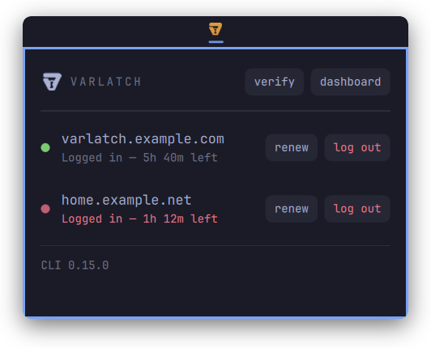

<p align="center">
  
</p>

<h1 align="center">Varlatch for Omarchy</h1>

<p align="center">
  Your <a href="https://github.com/varlatch/varlatch">Varlatch</a> sessions in the Omarchy bar:
  which servers you are signed in to, when each credential expires,
  and one-click sign-in, renewal, and sign-out.
</p>

<p align="center">
  <a href="LICENSE"></a>
  <a href="https://github.com/varlatch/varlatch/releases/latest"></a>
</p>

<p align="center">
  
</p>

```bash
omarchy plugin add https://github.com/varlatch/omarchy-plugin.git --enable
```

Everything it shows comes from `varlatch status --json`; see [Install](#install).

## What it shows

The Varlatch mark, icon only, with its state told by color:

- **theme foreground:** at least one live session
- **amber:** less than 20% of a credential's lifetime remains
- **red:** signed out, or a credential has expired
- **red, dimmed:** the `varlatch` CLI is missing or too old

A left click opens a panel under the widget with one row per session: a
live countdown, sign-out and sign-in per server, a **renew** button for
every live session, and buttons to verify credentials and open the
dashboard, and **add server** to sign in to one more. A middle click opens
the **Varlatch** submenu of the Omarchy menu, which SUPER+SPACE also finds.
The widget keeps that submenu in step with your sessions. After a full
sign-out, "Log in" still targets the last server you used, remembered in
`~/.local/state/varlatch-omarchy/servers.json`.

## First run

Without the `varlatch` CLI, the panel offers **install CLI**. It opens a
terminal that asks for your server's address, so it can install the CLI
version that server runs (press Enter for the latest release). It then
downloads the release CLI and checks it the same way an update does (see
below), installs it as `~/.local/bin/varlatch` once you confirm, and offers
the first sign-in. When `~/.local/bin` is not on your `PATH`, it points the
widget at the file instead. The release CLI needs Node.js 22 or newer; on
Omarchy, `omarchy install dev-env node` installs it.

With the CLI but no server known yet, the panel asks for the server's
address, and **connect** starts the browser sign-in. The menu's
**Connect to a server** row opens the same form.

"Verify" runs `varlatch status --probe`: one authenticated request per
stored credential, to check that it is still valid and its server
reachable.

Moving into *expiring* or *expired* triggers one desktop notification each,
with a **Renew now** or **Log in** button.

Renewing means signing in again to the same server. From Varlatch 0.10.0 on,
the CLI revokes the credential it replaces only after the new one is
verified and saved, so a cancelled or failed browser sign-in never signs you
out.

The panel's footer shows the CLI version. With `checkUpdates` on, it also
shows when a newer release is out, with **notes** and, when the plugin can
replace your CLI, **update**. A new release also triggers one notification,
and an **Update CLI** row appears in the menu.

**update** opens a terminal and runs `varlatch self-update` (Varlatch
0.11.0 and newer), using `sudo` when the CLI's directory is not writable.
For an older CLI, the plugin does the same steps itself. Either way, it
downloads `varlatch-cli-<version>.cjs` and `SHA256SUMS` from the release,
checks the signature on `SHA256SUMS` when the release carries one and
`cosign` is installed, checks the file against it, shows what it verified,
and replaces the CLI only after you confirm. This works only for the
release build. A CLI built from a source checkout, or a `varlatchCommand`
with arguments, gets the release notes instead, since you update those
yourself.

Signing in needs no terminal window. The CLI opens your browser for the
passkey prompt, and while it waits the panel shows "Signing in to …" with
**open link**, for when the page opens in the wrong browser, and **cancel**.
The result arrives as a notification.

## Privacy

The widget polls `varlatch status --json` on a timer, which reads local
files only (`~/.config/varlatch/credentials.json` and repository-local
state). It never uses a stored credential on its own; the only network
requests are the ones you start with a click, and, with `checkUpdates` on,
an anonymous check for the latest release at most twice a day, cached in
`~/.local/state/varlatch-omarchy/update.json`.

## Settings

Set these with `omarchy bar set varlatch <key> <value>` (add `--json` for
`refreshIntervalSec`), or on the widget's entry in
`~/.config/omarchy/shell.json`:

- `refreshIntervalSec`: how often to poll, in seconds (default 30, minimum
  15).
- `varlatchCommand`: the CLI to run (default `varlatch` on your `PATH`). For
  a development build, use for example
  `node /path/to/varlatch/apps/cli/dist/main.js`.
- `notifyExpiry`: `on` or `off`.
- `showWhenLoggedOut`: `on` or `off`. With `off`, the widget hides entirely
  when no credentials are stored.
- `checkUpdates`: `on` or `off` (default `off`). With `on`, the widget
  looks for new CLI releases on GitHub.
- `showLocalhost`: `on` or `off` (default `off`). With `off`, sessions on
  `localhost` or `127.*` are ignored everywhere: the bar color, the panel,
  the menu, notifications, and the sign-in and dashboard targets.

## Install

```bash
omarchy plugin add https://github.com/varlatch/omarchy-plugin.git --enable
```

This clones the plugin into `~/.config/omarchy/plugins/varlatch` and puts
the widget on the bar. The widget adds its **Varlatch** submenu to
`~/.config/omarchy/extensions/omarchy-menu.jsonc` by itself, as a managed
block between `// >>> varlatch plugin` and `// <<< varlatch plugin` that it
rewrites as your sessions change. Leave that block alone; everything
outside it stays yours.

Update with `omarchy plugin update varlatch`; remove with
`omarchy plugin remove varlatch`, then delete the managed block.

Requires `jq`, `python3`, and the Varlatch CLI 0.8.0 or newer, which the
panel can install (see [First run](#first-run)). With a CLI before 0.10.0,
the widget works out the *expiring* state itself.

## License

Copyright © 2026 Robotsson. Licensed under the Apache License 2.0; see
[`LICENSE`](LICENSE).
